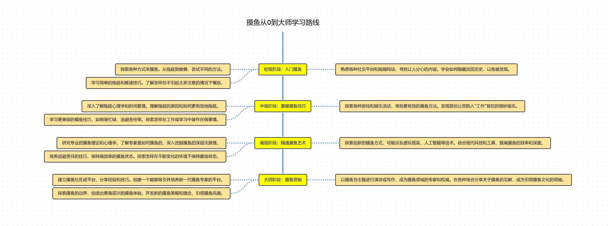

# Roadmap Render

[![npm version][npm-version-src]][npm-version-href]
[![npm downloads][npm-downloads-src]][npm-downloads-href]
[![bundle][bundle-src]][bundle-href]
[![JSDocs][jsdocs-src]][jsdocs-href]
[![License][license-src]][license-href]
[![javascript_code style][code-style-image]][code-style-url]

This project, `roadmap-render`, is a JavaScript library that enables the conversion of wireframe JSON data into scalable vector graphics (SVG) for rendering roadmaps or visual representations of user interfaces.

## Features

### Conversion Utilities
- **Decimal Color Conversion:** `decimalToRGB` function to convert decimal color values to their RGB representation.
- **SVG Element Creation:** `createSVGElement` function facilitating the creation of SVG elements with attributes.

### Renderer Class
The `Renderer` class acts as the main component responsible for rendering controls based on the provided wireframe data. It includes methods to render various control types like rectangles, text inputs, arrows, icons, horizontal rules, and grouped elements.

### Control Parsing and Rendering
- **Control Parsing:** Functions to parse control properties such as color, font styles, and measurements.
- **Rendering Functions:** Methods to render different control types by generating corresponding SVG elements.

### Wireframe to SVG Conversion
- **`wireframeJSONToSVG` Function:** Converts wireframe JSON data into SVG elements using the provided options, including padding, font family, and font URL.

## Usage
To use this library:
1. Import the necessary functions and classes from the library.
2. Call the `wireframeJSONToSVG` function with wireframe data and optional rendering options.
3. Integrate the resulting SVG element into your application or user interface.

## Installation
To install this library, clone the repository and include the necessary files in your project. Ensure to link this library in your HTML files using script tags.

## Contributing
We welcome contributions! Please submit issues or pull requests for any enhancements, bug fixes, or new features.

## License

[MIT](./LICENSE) License &copy; 2023-PRESENT [Kirk Lin](https://github.com/kirklin)

<!-- Badges -->

[npm-version-src]: https://img.shields.io/npm/v/roadmap-render?style=flat&colorA=080f12&colorB=3491fa
[npm-version-href]: https://npmjs.com/package/roadmap-render
[npm-downloads-src]: https://img.shields.io/npm/dm/roadmap-render?style=flat&colorA=080f12&colorB=3491fa
[npm-downloads-href]: https://npmjs.com/package/roadmap-render
[bundle-src]: https://img.shields.io/bundlephobia/minzip/roadmap-render?style=flat&colorA=080f12&colorB=3491fa&label=minzip
[bundle-href]: https://bundlephobia.com/result?p=roadmap-render
[license-src]: https://img.shields.io/github/license/kirklin/roadmap-render.svg?style=flat&colorA=080f12&colorB=3491fa
[license-href]: https://github.com/kirklin/roadmap-render/blob/main/LICENSE
[jsdocs-src]: https://img.shields.io/badge/jsdocs-reference-080f12?style=flat&colorA=080f12&colorB=3491fa
[jsdocs-href]: https://www.jsdocs.io/package/roadmap-render
[code-style-image]: https://img.shields.io/badge/code__style-%40kirklin%2Feslint--config-3491fa?style=flat&colorA=080f12&colorB=3491fa
[code-style-url]: https://github.com/kirklin/eslint-config/
